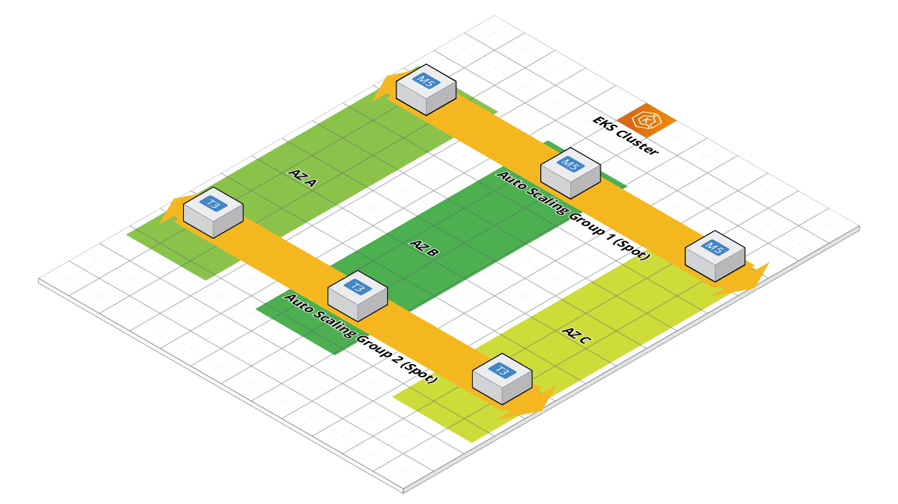

cf-eks
======

Create an EKS cluster with CloudFormation.


Implements the steps described in
https://aws.amazon.com/blogs/compute/run-your-kubernetes-workloads-on-amazon-ec2-spot-instances-with-amazon-eks/

Requirements
------------

To install the Python requirements for this package, run the following:

```shell
pip install -r requirements.txt
```

Role Variables
--------------

| Name | Default | Mandatory | Description |
| ---- | ------- | --------- | ----------- |
| `cf_eks_node_auto_scaling_group_max_size` | 3 |  | The maximum number of nodes for the auto scaling groups. |
| `cf_eks_node_auto_scaling_group_min_size` | 1 |  | The minimum number of nodes for the auto scaling groups. |
| `cf_eks_node_volume_size` | 20 | | The size in Gigabytes of the volumes to be deployed with each spot instance. |
| `cf_eks_spot_node_1_instance_type` | m5.medium | | The instance type for the first auto scaling group. |
| `cf_eks_spot_node_2_instance_type` | t3.medium | | The instance type for the second auto scaling group. |
| `cf_eks_source_cidr` | 0.0.0.0/0 | | CIDR/IP range for instance ssh access. |
| `cf_eks_spot_price` | 1 | | Spot Price (Only Spot market price is charged, up to max of On-Demand price. Value here is only used to prevent EC2 instance launch if Spot market price exceeds this value.) |
| `cf_eks_stack_name` | eks | | The name of the cluster to be created. |
| `cf_eks_state` | present | | The state of the CloudFormation stack.  Set to "absent" to remove. |
| `cf_eks_tags` | {} | | A dictionary of tags to apply to the resources created by CloudFormation. |
| `cf_eks_version` | 1.19 | | The version of EKS to deploy the cluster as (changing this is not a minor operation). |


Example Playbook
----------------

```YAML
---
- name: Deploy an EKS Cluster via CloudFormation

  connection: local

  hosts: localhost

  vars:
    cf_eks_key_name: github
    cf_eks_node_image_id: ami-06ac47ff0f82c613c
    cf_eks_tags:
      cost-centre: "{{ cost_centre }}"

  roles:
    - "ansible-role-cf-eks"
```

License
-------

BSD

Author Information
------------------

Madhuri Peri <mperi@amazon.com> and Shawn OConnor <shawo@amazon.com>.  Updated
and [minor] corrections by Ben Dalling.
